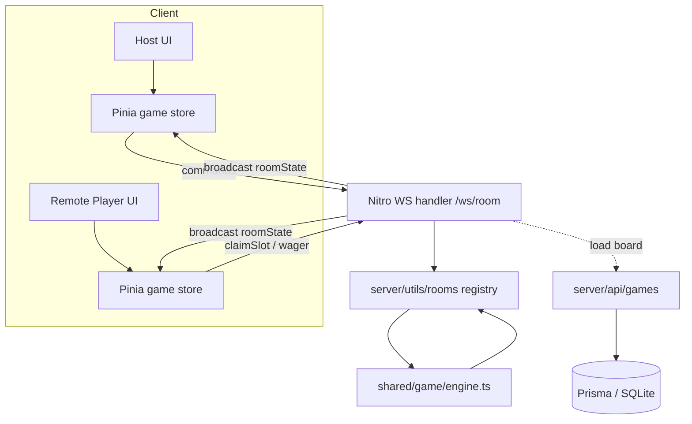

> **Status note (kept for history).** This plan was written before the requirements were
> confirmed with the host. **[`docs/JEOPARDY.md`](../../docs/JEOPARDY.md) is the source of truth.**
> Differences that are now settled there and _not_ corrected throughout this document:
>
> - **Final Jeopardy is cut from the product** — ignore every `FinalClue` / final-round mention below.
> - Joining works by **room code and shareable link**, not link only.
> - Players buzz in (online players on their own device, host for local seats) with
>   latency compensation; "buzzers out of scope" below is obsolete.
> - Milestones and their order are tracked in `docs/JEOPARDY.md` §8 (online play is a fast-follow, M3).
>
> Implementation status: **M0 (data model, seed, board API) is done** — see the Delivery Steps note below.

# Requirements

### Overview & Goals

Build a **Jeopardy-style quiz app** on top of this Nuxt 3 template. It recreates the classic experience: a category × point-value board, click-to-reveal clues, Daily Double / Final Jeopardy wagering, and running score tracking. The **host always controls clue reveals and scoring** (host-adjudicated play).

Two ways to play:

- **Local hotseat** — everyone on one screen; host runs the whole game.
- **Online mode** — host creates a game and shares a link; the host configures an **RTS-style lobby (Warcraft 3-style)** where each player slot is either **Open** (a remote player joins via the link) or **Filled by the host** (a locally-managed seat the host plays on behalf of). The host still reveals clues and adjudicates scoring for everyone.

This supersedes the earlier "local hotseat only" default (Q1) — online realtime mode is now in scope.

### Scope

#### In scope

- Category × point-value board with reveal-on-click clues.
- 2–6 player slots; per-slot state: **Open** (joinable), **Filled (host)** (host-managed named seat), **Closed** (disabled/not counted).
- **Local hotseat** mode: all slots host-managed on one screen.
- **Online mode**: host creates a room, shares a **link** (embedded room id); remote players open the link, pick an open slot, and enter a display name.
- **Server-authoritative** online room: Nitro holds room state (slots, players, board, scores, phase) over **WebSockets**; host sends control commands, server broadcasts state to all clients.
- Host-controlled scoring: add on correct, subtract on wrong, host adjudication.
- **Daily Double**: hidden clue with a pre-reveal wager bounded by the player's score.
- **Final Jeopardy**: category shown, all players wager, single clue, host reveals.
- Seeded sample boards (Prisma seed) so the game is playable with zero setup.
- End-of-game summary with final standings.

#### Out of scope (revisit later)

- Player-side buzz-in timing/lock competition (host adjudicates instead of buzzers).
- AI/auto-play bots (filled slots are host-managed seats, not AI).
- Board authoring/admin UI (content is seeded).
- Authentication, user profiles, persistent leaderboards, game-history persistence.
- Per-clue timers, audio/voice, media (image/video/audio) clues.
- Room reconnection recovery beyond basic rejoin-by-slot.

### User Stories

- As a **host**, I want to start a **local hotseat** game with named players so we can play on one screen.
- As a **host**, I want to create an **online** game and share a link so remote friends can join.
- As a **host**, I want to set each slot to **Open**, **Filled (me)**, or **Closed** — like an RTS lobby — so I can mix remote players and seats I run myself.
- As a **remote player**, I want to open the link, claim an open slot, and enter my name so I appear on the board.
- As a **host**, I want to reveal clues and mark answers right/wrong so I control adjudication and scoring for everyone.
- As a **player**, I want to place Daily Double / Final Jeopardy wagers bounded by my score.
- As a **host**, I want an end-of-game standings screen.

### Functional Requirements

- Board renders categories as columns and increasing point values as rows; revealed clues are visually marked.
- Lobby shows N slots; host toggles each slot's state; game can only start when ≥2 active (Open-claimed or Filled) players exist.
- Online: state changes (slot claimed, clue revealed, score change, phase change) propagate to all connected clients in near real time.
- Scoring: correct adds the clue value; wrong subtracts it; host controls who is adjudicated.
- Daily Double wager bounded to `[minWager, max(playerScore, boardMax)]`; hidden until wager set.
- Final Jeopardy: all active players submit a wager (host can enter for filled seats), then host reveals the clue and adjudicates.
- Game ends when all clues are revealed and Final Jeopardy is resolved; results screen shows standings sorted by score.

### Non-Functional Requirements

- **No new core technologies** beyond enabling Nitro's built-in WebSocket support (crossws ships with Nitro). Everything else reuses `docs/STACK.md`.
- TypeScript `strict`; shared types between client and Nitro server; all WS/HTTP boundaries validated with **Zod**.
- Keep Prisma schema portable (SQLite dev / Postgres prod).
- Domain logic lives outside Vue components (Pinia store + server room module).

# Technical Design

### Current Implementation

- Nuxt 3 template with Nitro server routes under `server/api/`, validated at the boundary with Zod
  (`getValidatedRouterParams` / `readValidatedBody`). The board routes are `server/api/games/index.get.ts`
  and `server/api/games/[id].get.ts`; queries and row mapping live in `server/utils/games.ts`.
- `server/utils/prisma.ts` exposes an auto-imported `prisma` client; `server/utils/env.ts` validates env;
  `server/utils/errors.ts` keeps internal schema failures from leaking to clients.
- Prisma schema holds the Jeopardy domain: `Game` / `Category` / `Clue` (the placeholder `User` model and
  its `server/api/users/*` routes were removed in M0).
- Pinia is enabled via `@pinia/nuxt`; shared UI primitives live in `shared/ui`.
- `docs/JEOPARDY.md` has since been rewritten to the approved local + online design and is the accurate source of truth (Delivery Step 1, done).

### Key Decisions

- **Realtime transport → Nitro WebSockets** (`defineWebSocketHandler`, crossws). Enabled via `nitro.experimental.websocket` in `nuxt.config.ts`. Chosen for full-duplex lobby + game sync with no extra infra.
- **State authority → Server-authoritative room.** Nitro owns the room state (slots, players, board with revealed flags, scores, phase, wagers). Clients send commands; server validates and broadcasts the full/patched state. Prevents client divergence and survives host UI reloads.
- **Joining → Shareable link only.** Host gets a URL with an embedded room id; remote players open it, claim an Open slot, and enter a display name. No separate code entry.
- **Filled slots → host-managed seats** (no AI). A Filled slot is a named player the host plays for locally.
- **Shared game engine.** A single pure, framework-agnostic reducer (`shared/game/engine.ts`) computes state transitions. It is used **both** by the local Pinia store (hotseat) and the server room (online), so scoring/wager rules exist once and are unit-tested once.

### Proposed Changes

#### Data model (Prisma) — content only

Board content is seeded; live game/room state is in-memory (server room) or in the Pinia store (local).

**As shipped in M0** (differs from the sketch below): no `FinalClue` model, `Clue` carries both `position`
(0-based row) and `value`, and `Game` has `createdAt` + `updatedAt`. See `prisma/schema.prisma`.

```prisma
model Game {
    id         String     @id @default(cuid())
    title      String
    categories Category[]
    finalClue  FinalClue?
    createdAt  DateTime   @default(now())
}

model Category {
    id       String @id @default(cuid())
    title    String
    position Int
    game     Game   @relation(fields: [gameId], references: [id], onDelete: Cascade)
    gameId   String
    clues    Clue[]
}

model Clue {
    id            String   @id @default(cuid())
    value         Int
    prompt        String
    solution      String
    isDailyDouble Boolean  @default(false)
    category      Category @relation(fields: [categoryId], references: [id], onDelete: Cascade)
    categoryId    String
}

model FinalClue {
    id       String @id @default(cuid())
    category String
    prompt   String
    solution String
    game     Game   @relation(fields: [gameId], references: [id], onDelete: Cascade)
    gameId   String @unique
}
```

#### Shared engine & types (`shared/`)

- `shared/types/game.ts` — Zod schemas + inferred types for `BoardState`, `Player`, `Slot` (`{ index, state: 'open'|'filled'|'closed', player? }`), `GamePhase` (`lobby | board | clue | dailyDouble | final | done`).
- `shared/types/room.ts` — Zod schemas for **client→server commands** (`claimSlot`, `setSlotState`, `startGame`, `openClue`, `adjudicate`, `setWager`, `revealFinal`, `endGame`) and **server→client events** (`roomState`, `error`).
- `shared/game/engine.ts` — pure functions: `createInitialState`, `applyCommand(state, command)` returning next state; enforces invariants (wager bounds, clue scored once, phase transitions, active-player count ≥ 2 to start).

#### Server (online mode)

- `server/api/games/index.get.ts` and `server/api/games/[id].get.ts` — list/fetch seeded boards (Zod-validated output) via the `server/utils/games.ts` repository. _Shipped in M0._
- `server/api/rooms/index.post.ts` — create a room for a chosen `gameId`; returns `{ roomId }` used to build the share link.
- `server/utils/rooms.ts` — in-memory room registry (`Map<roomId, RoomState>`) plus helpers to apply a validated command via `shared/game/engine.ts`.
- `server/routes/ws/room.ts` — `defineWebSocketHandler` with `open`/`message`/`close`. On message: parse+validate command (Zod), authorize (only host may reveal/adjudicate/start; a peer may only `claimSlot` for itself), apply via engine, then broadcast `roomState` to the room via `peer.publish`/subscribe channel keyed by `roomId`.

#### Client

- `stores/game.ts` — Pinia store. For **local** mode it wraps `shared/game/engine.ts` directly. For **online** mode it opens a WebSocket, sends commands, and applies broadcast `roomState`. A `mode` flag (`local | online`) selects the path; components stay identical.
- `composables/useGameSocket.ts` — thin WS client wrapper (connect, send typed command, subscribe to `roomState`).
- Pages:
    - `pages/index.vue` — landing: start local game or create online game.
    - `pages/lobby/[roomId].vue` — RTS-style lobby: slot list with Open/Filled/Closed controls (host) and slot-claim + name entry (remote players); share-link display for host.
    - `pages/play/[roomId].vue` — board grid, clue modal, scoreboard, host adjudication controls.
    - `pages/results/[roomId].vue` — final standings.

#### Components (`components/` + `shared/ui`)

- `shared/ui`: add a `UiModal`/dialog primitive (Headless UI) for the clue modal; reuse `UiButton`.
- `components/`: `BoardGrid.vue`, `ClueModal.vue`, `Scoreboard.vue`, `LobbySlot.vue`, `WagerForm.vue` — presentational, driven by store state.

### File Structure

```
prisma/schema.prisma          # Game/Category/Clue (no FinalClue) — done
prisma/boards.ts              # bundled board content (+ boards.test.ts) — done
prisma/seed.ts                # transactional seed of the bundled boards — done
server/utils/games.ts         # board repository + row mapping (+ games.test.ts) — done
server/utils/errors.ts        # internal-error mapping for handlers — done
shared/types/game.ts          # board/player/slot/phase Zod + types
shared/types/room.ts          # command + event Zod schemas
shared/game/engine.ts         # pure reducer (+ engine.test.ts)
server/api/games/index.get.ts
server/api/games/[id].get.ts
server/api/rooms/index.post.ts
server/utils/rooms.ts         # in-memory room registry
server/routes/ws/room.ts      # Nitro WebSocket handler
stores/game.ts                # local + online store (+ game.test.ts)
composables/useGameSocket.ts
components/BoardGrid.vue | ClueModal.vue | Scoreboard.vue | LobbySlot.vue | WagerForm.vue
shared/ui/                    # UiModal primitive (+ story)
pages/index.vue | lobby/[roomId].vue | play/[roomId].vue | results/[roomId].vue
nuxt.config.ts                # enable nitro.experimental.websocket
docs/JEOPARDY.md              # update Q1 decision + online design
docs/STACK.md                 # note Nitro WebSocket usage
```

### Architecture Diagram



### Risks

- **In-memory rooms** are lost on server restart and don't scale horizontally — acceptable for MVP; documented as a limitation.
- **Host disconnect** during an online game pauses adjudication; MVP allows host to reopen the link and reclaim the host role (best-effort), full recovery deferred.
- **crossws/Nitro WebSocket** is behind an experimental flag; verify it works with the deployment target early.
- **SQLite↔Postgres parity**: keep the schema portable (no SQLite-only features).

# Testing

### Validation Approach

Most game rules live in the pure `shared/game/engine.ts` reducer, so the bulk of logic is covered by fast Vitest unit tests independent of Vue/Nitro. Store integration and a full online flow are covered with component tests and a Playwright e2e using two browser contexts (host + remote player).

### Key Scenarios

- **Engine (Vitest):** start with 2–6 players; open clue → adjudicate correct adds value, wrong subtracts; a clue can only be scored once; phase transitions `lobby → board → clue → board … → final → done`.
- **Wagers (Vitest):** Daily Double wager bounded to allowed range; Final Jeopardy collects a wager per active player before reveal; scores update correctly on reveal.
- **Lobby (Vitest + component):** slot state toggles Open/Filled/Closed; game cannot start with <2 active players; filled seats are host-managed.
- **Store (component):** local mode mutates via engine; online mode sends commands and applies broadcast `roomState`.
- **Online e2e (Playwright, two contexts):** host creates game → shares link → second context opens link, claims a slot, enters name → host reveals clue, adjudicates → both screens reflect updated scores → Final Jeopardy → results standings.

### Edge Cases

- Remote player tries to claim an already-claimed or Closed slot → rejected with an error event.
- Non-host peer sends a host-only command (reveal/adjudicate/start) → rejected server-side.
- Invalid/malformed WS command payload → rejected by Zod, no state change.
- Wager exceeding score or below minimum → clamped/rejected.
- Game start attempted from lobby with <2 active players → blocked.

### Test Changes

- Add `shared/game/engine.test.ts` (primary rule coverage).
- Add `stores/game.test.ts` for store local/online behavior.
- Add component tests for `LobbySlot.vue`, `ClueModal.vue`, `Scoreboard.vue`.
- Add `tests/e2e/online-game.spec.ts` (two-context flow) and `tests/e2e/local-game.spec.ts` (hotseat happy path).

# Delivery Steps

### Step 1: Sync docs/JEOPARDY.md with the local + online decision

`docs/JEOPARDY.md` accurately documents the approved local-hotseat-plus-online design instead of the stale "local hotseat only" MVP.

- Rewrite the **Product vision** (§1) to describe both play modes: local hotseat and server-authoritative online with an RTS-style lobby.
- Update the **Product inquiries** table (§2): mark **Q1** as resolved → _Local hotseat **and** online mode_; record the Round 2 answers (Nitro WebSockets transport, server-authoritative room, shareable-link joining, host-managed filled slots).
- Replace the **Scope** section (§3) with the in/out scope from the Requirements tab (RTS slots Open/Filled(host)/Closed, host-adjudicated scoring, buzzers/AI-bots out of scope).
- Update the **Tech stack** table (§4) to note enabling Nitro's built-in WebSocket support (crossws) and the shared engine reused by client + server.
- Extend the **data model** (§5) note to clarify live game/room state is in-memory (server room) / Pinia (local), content-only in Prisma.
- Replace the **deferred online multiplayer** note (§7) with the now-in-scope online design: `shared/game/engine.ts`, `server/utils/rooms.ts`, `server/routes/ws/room.ts`, Zod command/event schemas.
- Update the **Milestones** (§8) and **Definition of Done** (§9) to match the six delivery steps below.
- Add an **architecture diagram** (host/player → Nitro WS → room registry → shared engine) mirroring the Technical Design tab.

### Step 2: Data model, seed, and board API

Seeded Jeopardy boards are fetchable via HTTP.

_Done (M0), with these deviations:_

- Replaced the placeholder `User` model in `prisma/schema.prisma` with `Game`, `Category`, `Clue` (no `FinalClue`); migrations created.
- Added `prisma/boards.ts` (content) + `prisma/seed.ts` (transactional, refuses to run in production) seeding two full boards with Daily Doubles.
- Added Zod schemas + inferred types for board content in `shared/types/game.ts`; player/slot/phase types follow with the engine.
- Added `server/api/games/index.get.ts` and `server/api/games/[id].get.ts` (Zod-validated output) on top of the `server/utils/games.ts` repository.

### Step 3: Shared game engine and local hotseat mode

A host can play a full local hotseat game end-to-end.

- Implement the pure reducer `shared/game/engine.ts` (`createInitialState`, `applyCommand`) enforcing scoring, phase transitions, and clue-scored-once invariants, with `engine.test.ts`.
- Implement `stores/game.ts` (Pinia) wrapping the engine for local mode, with `game.test.ts`.
- Build `components/BoardGrid.vue`, `ClueModal.vue`, `Scoreboard.vue` and a `UiModal` primitive in `shared/ui`.
- Build `pages/index.vue` (start local game, add players) and `pages/play/[roomId].vue` for host-adjudicated play.

### Step 4: Daily Double and Final Jeopardy twists

Wagering mechanics and end-of-game standings work in local mode.

- Extend `shared/game/engine.ts` with Daily Double wager bounds and Final Jeopardy wager collection + reveal, covered by unit tests.
- Add `components/WagerForm.vue` and wire the Daily Double and Final Jeopardy flows into the play screen.
- Add `pages/results/[roomId].vue` showing final standings sorted by score.

### Step 5: Server-authoritative online rooms over WebSockets

Rooms exist on the server and sync state to all clients in real time.

- Enable `nitro.experimental.websocket` in `nuxt.config.ts`.
- Add `shared/types/room.ts` with Zod schemas for client→server commands and server→client events.
- Add `server/utils/rooms.ts` (in-memory room registry applying commands via the shared engine) and `server/api/rooms/index.post.ts` to create a room and return its id.
- Add `server/routes/ws/room.ts` (`defineWebSocketHandler`) that validates + authorizes commands (host-only vs self-claim) and broadcasts `roomState` per room.

### Step 6: Online lobby, client socket, and RTS-style slots

A host shares a link; remote players join open slots while the host fills others.

- Add `composables/useGameSocket.ts` (typed WS client) and extend `stores/game.ts` with an online `mode` that sends commands and applies broadcast `roomState`.
- Build `pages/lobby/[roomId].vue` with the share-link display and per-slot Open/Filled(host)/Closed controls, plus `components/LobbySlot.vue` and remote-player slot-claim + name entry.
- Enforce start-guard (≥2 active players) and route host + players into `play/[roomId].vue`.

### Step 7: Tests, docs polish, and STACK note

The full experience is verified and documentation stays aligned.

- Add Playwright `tests/e2e/local-game.spec.ts` (hotseat happy path) and `tests/e2e/online-game.spec.ts` (two-context host + remote player flow).
- Add component tests for `LobbySlot.vue`, `ClueModal.vue`, `Scoreboard.vue`, and Storybook stories for the new `shared/ui` primitives.
- Note Nitro WebSocket usage in `docs/STACK.md`, and re-verify `docs/JEOPARDY.md` still matches the shipped implementation (updating any details that changed during the build).
- Run `pnpm lint`, `pnpm typecheck`, Vitest, and Playwright; a11y/responsive pass on board and lobby.
